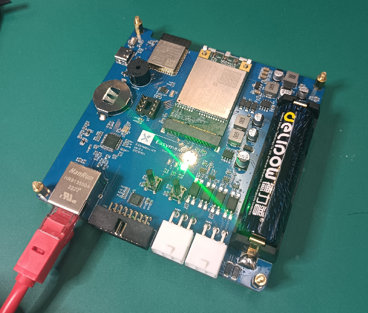
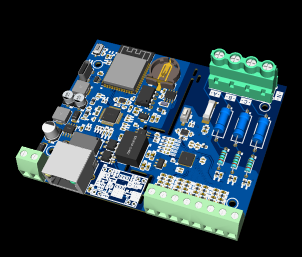
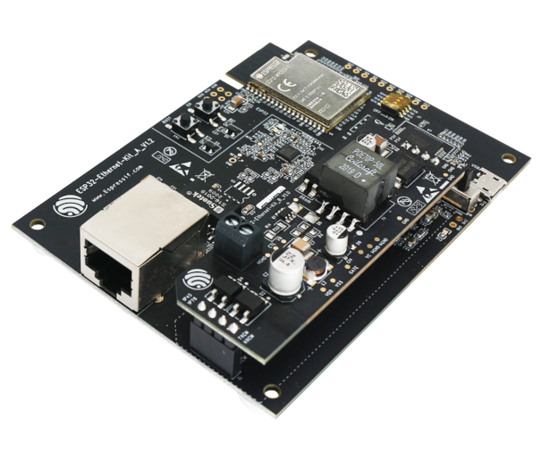

# Wi-Fi, Ethernet, and 4G/LTE Network Router

* Derived from [eth2ap Example][eth2ap]
* Tested using [ESP-IDF framework version 5.0][esp-idf-v5.0]

## Overview

**Note:** In this project, ESP32 works like a *bridge* between Ethernet and Wi-Fi, and it won't perform any actions on Layer3 and higher layer, which means there's no need to initialize the TCP/IP stack.

**Note:** 4G LTE network routing is still work-in-progress.

## How to use example

### Hardware Required

| [PCBCrew Easymeal IoT][pcbcrew-easymeal-iot]                       | [PCBCrew BLDGOT kWh][pcbcrew-bldgot-kwh]                            | [ESP32-Ethernet-Kit][esp32-ethernet-kit]                       |
| ------------------------------------------------------------------ | ------------------------------------------------------------------- | -------------------------------------------------------------- |
|  |  |  |

### Configure the project

```
idf.py menuconfig
```

In addition to the common configurations for Ethernet, you might also need to update the default value of following configurations:

In the `Example Configuration` menu:
* Set the SSID and password for Wi-Fi ap interface under `Wi-Fi SSID` and `Wi-Fi Password`.
* Set the maximum connection number under `Maximum STA connections`.

### Build, Flash, and Run

Build the project and flash it to the board, then run monitor tool to view serial output:

```
idf.py -p PORT build flash monitor
```

(Replace PORT with the name of the serial port to use.)

(To exit the serial monitor, type ``Ctrl-]``.)

See the [Getting Started Guide](https://docs.espressif.com/projects/esp-idf/en/latest/get-started/index.html) for full steps to configure and use ESP-IDF to build projects.

## Example Output and ## Troubleshooting

Check the original documentation of [eth2ap Example][eth2ap].


[esp-idf-v5.0]: https://github.com/espressif/esp-idf/tree/release/v5.0
[eth2ap]: https://github.com/espressif/esp-idf/tree/release/v5.0/examples/ethernet/eth2ap
[pcbcrew-easymeal-iot]: https://github.com/dumtux/pcbcrew-easymeal-iot
[pcbcrew-bldgot-kwh]: https://github.com/dumtux/[pcbcrew-bldgot-kwh]
[esp32-ethernet-kit]: https://docs.espressif.com/projects/esp-idf/en/latest/esp32/hw-reference/esp32/get-started-ethernet-kit.html
